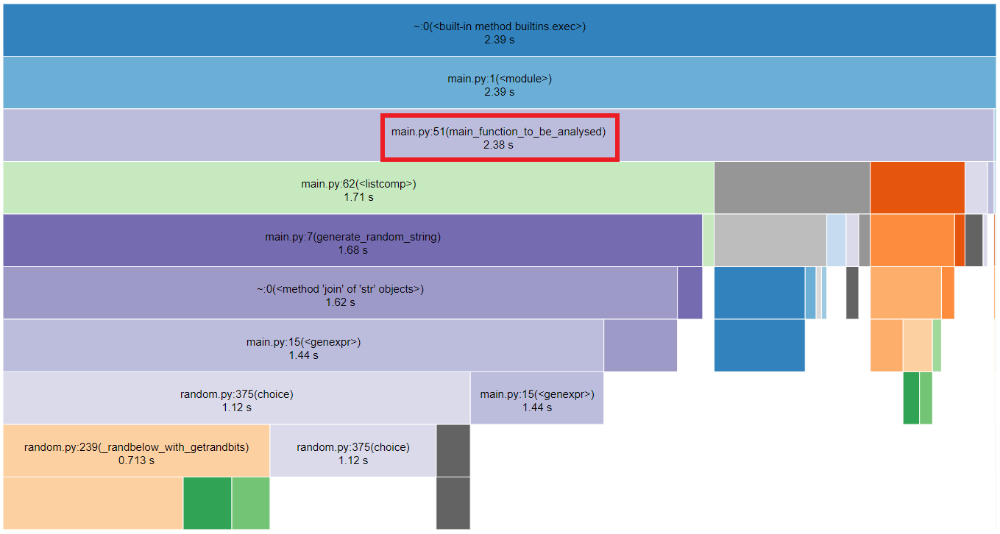
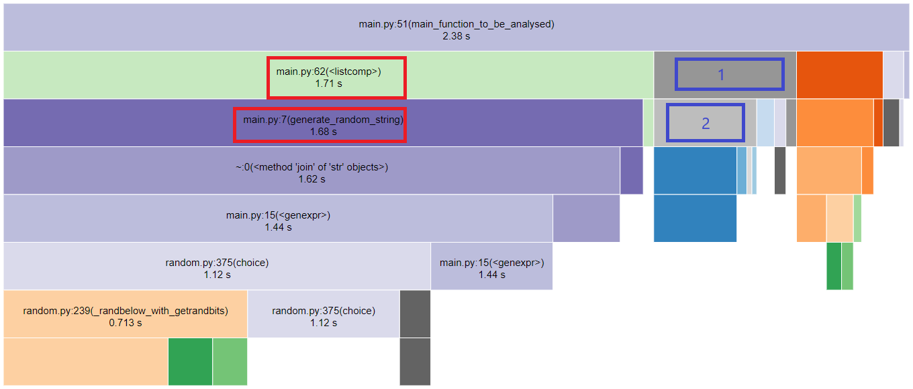

# Snakeviz profiling


## Profiling 🧪
Python has it's own built in profiling tool called cProfile. You can use the cProfile module at the command line to create a profile file like this.
``` sh
python -m cProfile -o <profiling-file> <module-name> <args>
```

Example:
``` sh
python -m cProfile -o program.prof main.py 100000
```
    
    
## Snakeviz 🐍
SnakeViz has two visualization styles, icicle (the default) and sunburst. In both the fraction of time spent in a function is represented by the extent of a visualization element, either the width of a rectangle or the angular extent of an arc. You can switch between the two styles using the “Style” dropdown. (See more below under Controls.)

Functions don’t only spend time calling other functions, they also have their own internal time. SnakeViz shows this by putting a special child on each node that represents internal time. Only functions that call other functions will have this, functions with no calls are entirely internal time.
``` sh
snakeviz <profiling-file>
```

Example:
``` sh
snakeviz program.prof
```

## Analysing the results 👁️‍🗨️

Snakeviz command will return an url where we will visualize all the execution details.  
In the example below we will see how _main_function_to_be_analysed()_ takes almost all the execution time. If we click on the function we will be able to watch the execution time with more detail.



Now we are able to see with more detail where the time is going. The longer time is spent in _listcomp_ function (red square), also _order_dict_by_value()_ is taking a lot of time (blue square with number 1).  
Going a level down, we see the what takes most of the execution time in _listcomp_ is the function _generate_random_string()_ so now we know from where to start to improving our code.  
On the other hand what makes _order_dict_by_value()_ function slow is _deepcopy_ (blue square with number 2), so here we have another flaw that should be studied.


